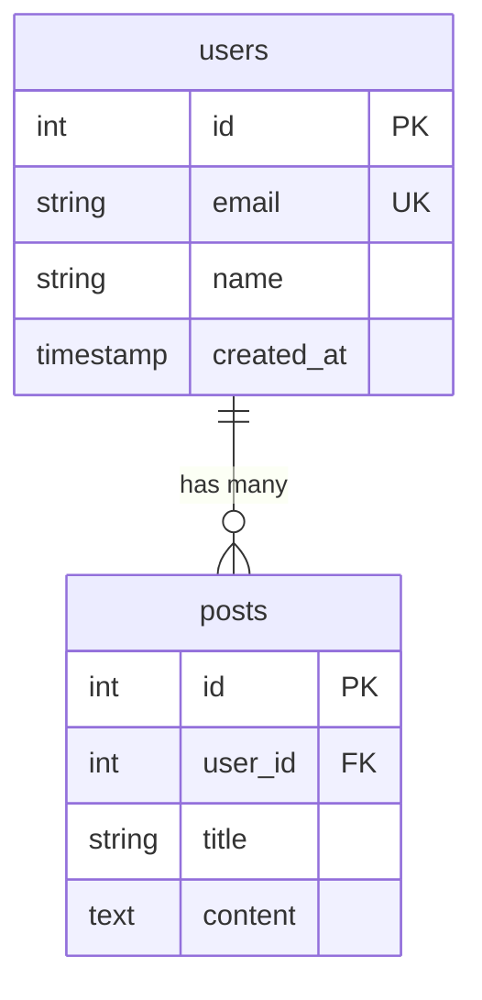

Analyze SQL schema files and generate a Mermaid entity relationship diagram.

Arguments: Path to SQL file(s) or directory containing schema files (*.sql)

Steps:

1. Find and read all relevant SQL schema files
2. Parse each table definition extracting:
   - Table name
   - Columns with types
   - Primary keys (PK)
   - Foreign keys (FK) and their references
   - Unique constraints (UK)
3. Generate a Mermaid erDiagram showing:
   - Each table as an entity with its columns
   - Relationships based on foreign keys
   - Cardinality notation (one-to-one, one-to-many, many-to-many)

4. Validate diagram by running: `npx -y @mermaid-js/mermaid-cli mmdc -i /dev/stdin -o /dev/null <<< '<diagram>'`
   - If validation fails, fix syntax errors and retry

5. Verify complete coverage:
   - List any tables not included in the diagram
   - List any foreign key relationships not represented

Output format:

Relationship notation:
- `||--||` one-to-one
- `||--o{` one-to-many
- `o{--o{` many-to-many (via junction table)

Notes:
- Simplify SQL types to readable names (VARCHAR -> string, INTEGER -> int, etc.)
- Include PK/FK/UK markers on relevant columns
- Name relationships descriptively when possible
- For large schemas, consider grouping related tables or generating multiple diagrams
