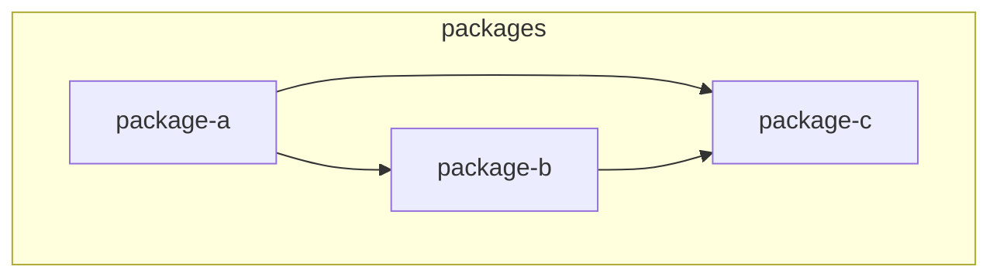

Analyze the monorepo structure and generate a Mermaid flowchart showing package dependencies.

Steps:

1. Find all package.json files in the monorepo (excluding node_modules)
2. For each package, extract:
   - Package name
   - Dependencies and devDependencies that reference other internal packages
3. Generate a Mermaid flowchart diagram showing:
   - Each package as a node
   - Arrows from packages to their internal dependencies

Output format:

Notes:
- Only show internal package dependencies (packages within the monorepo)
- Ignore external npm dependencies
- Use short readable node IDs (strip @scope/ prefixes for IDs, keep full name in label)
- Group packages by directory structure if there are clear subgroups (apps/, packages/, libs/)
